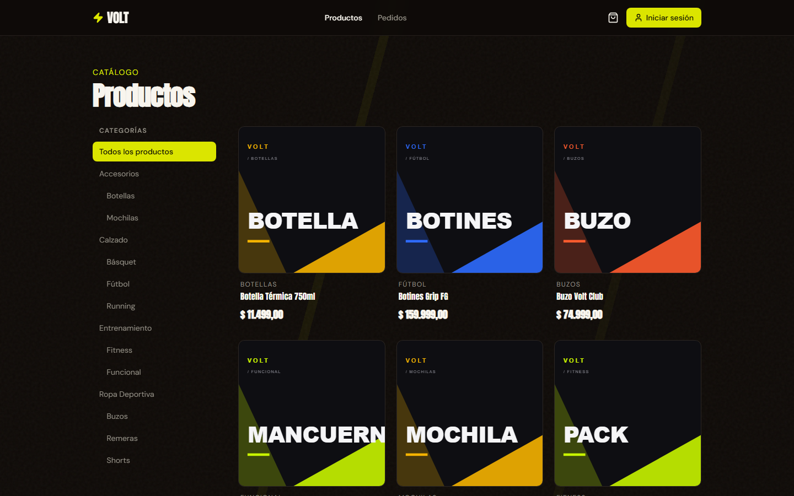
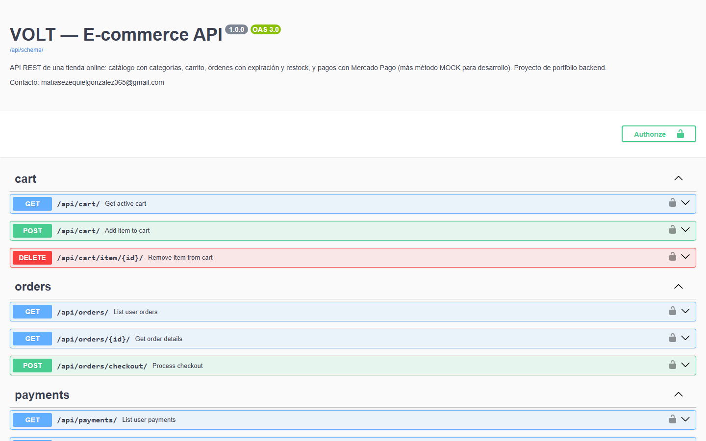

# E-commerce API — Django REST Framework

**[English](README.md) | [Español](README.es.md)**


A REST API for an online store, built with **Django REST Framework**.

It includes: a product catalog with categories, a shopping cart, orders with automatic expiration, payments with Mercado Pago (plus a `MOCK` method for development) and a webhook with HMAC-SHA256 signature verification.

> Made as a backend developer portfolio. Interactive API docs available in Swagger.

**Live Swagger:** https://volt-matiasglez-ecommerce.onrender.com/api/schema/swagger-ui/  
**Demo store (consumes this API):** https://volt-store-plum.vercel.app

| Home | Products | Swagger |
|------|----------|---------|
|  |  |  |

## Tech stack

- Python 3.12 / Django 6.1
- Django REST Framework 3.18
- djangorestframework-simplejwt (JWT auth)
- drf-spectacular (OpenAPI / Swagger)
- PostgreSQL 17
- django-cors-headers
- Docker + docker-compose
- Mercado Pago official SDK

## Features

- Register and login with JWT (access + refresh).
- Products with UUID, prices and stock; categories with recursive subcategories.
- Public read-only catalog; only staff can create or edit products.
- Per-user cart with accumulated stock check.
- Checkout: creates the order, decreases stock, empties the cart and sets an expiration date (15 minutes).
- Expired orders: when you try to pay, the order is cancelled and the stock is restored (with transactions to avoid overselling).
- MOCK payments (for development) and Mercado Pago (checkout preference).
- Mercado Pago webhook with HMAC-SHA256 signature check and idempotent handling.
- Custom admin for all apps.
- OpenAPI docs at `/api/schema/swagger-ui/`.

## Project structure

```
config/                  # settings, urls, wsgi/asgi
apps/
  users/                 # custom User model + JWT
  products/              # products and categories
  cart/                  # shopping cart
  orders/                # orders and expiration
  payments/              # payments, webhook and Mercado Pago integration
```

Each app has its own **models / serializers / views / services / schemas (OpenAPI) / tests**, and keeps the business logic in the services layer.

## Setup with Docker

Requirements: Docker and Docker Compose.

1. Clone the repository.
2. Create the `.env` file from `.env.example`:

   ```bash
   cp .env.example .env
   ```

3. Fill in the variables (see the table below).
4. Start the services:

   ```bash
   docker compose up --build
   ```

5. Run the migrations and create a superuser:

   ```bash
   docker compose run --rm web python manage.py migrate
   docker compose run --rm web python manage.py createsuperuser
   ```

The API runs at `http://localhost:8000`, the admin at `/admin/` and Swagger at `/api/schema/swagger-ui/`.

## Environment variables

| Variable | Description |
|---|---|
| `SECRET_KEY` | Django secret key. Use a long random value in production. |
| `DEBUG` | `True` for development, `False` in production. |
| `ALLOWED_HOSTS` | Allowed hosts, separated by commas. |
| `POSTGRES_DB` | Database name. Matches the `db` service (`ecommerce`). |
| `POSTGRES_USER` | Database user (`postgres` by default in the `db` service). |
| `POSTGRES_PASSWORD` | Database password (must match the `db` service). |
| `POSTGRES_HOST` | Database host (`db` with Docker Compose). |
| `POSTGRES_PORT` | Database port (`5432`). |
| `MP_ACCESS_TOKEN` | Mercado Pago access token (optional, only for real payments). |
| `MP_WEBHOOK_SECRET` | Secret to verify the webhook signature (optional, see webhook section). |
| `FRONTEND_URL` | Frontend URL used for the Mercado Pago `back_urls`. |
| `BACKEND_URL` / `WEBHOOK_URL` | Public URL that receives the webhook. |
| `CORS_ALLOWED_ORIGINS` | Allowed CORS origins, separated by commas. |
| `CSRF_TRUSTED_ORIGINS` | Trusted origins for CSRF. |

> The `db` service in `docker-compose.yml` has default credentials (`ecommerce` / `postgres` / `postgres`). If you change them in `.env`, update them in the `db` service too.

## Endpoints

### Auth (`/api/users/`)
| Method | Path | Description |
|---|---|---|
| POST | `/api/users/auth/register/` | Register a user (email + password). |
| POST | `/api/users/auth/login/` | Get `access` and `refresh` tokens. |
| POST | `/api/users/auth/token/refresh/` | Refresh the access token. |

### Products (`/api/products/`)
| Method | Path | Description |
|---|---|---|
| GET | `/api/products/` | List products (public). Query param `?category_id=`. |
| POST | `/api/products/` | Create a product (staff). |
| GET/PUT/PATCH/DELETE | `/api/products/{uuid}/` | Detail, update and delete (staff for writes). |
| GET/POST | `/api/products/categories/` | List root categories with subcategories / create a category (staff). |

### Cart (`/api/cart/`)
| Method | Path | Description |
|---|---|---|
| GET | `/api/cart/` | Current user cart (items + total). |
| POST | `/api/cart/` | Add a product or increase quantity (`product_id`, `quantity`). |
| DELETE | `/api/cart/item/{product_id}/` | Remove a product completely from the cart. |

### Orders (`/api/orders/`)
| Method | Path | Description |
|---|---|---|
| GET | `/api/orders/` | User orders. |
| GET | `/api/orders/{id}/` | Detail of a user order. |
| POST | `/api/orders/checkout/` | Create an order from the cart (decreases stock, expires in 15 minutes). |

### Payments (`/api/payments/`)
| Method | Path | Description |
|---|---|---|
| GET | `/api/payments/` | User payments. |
| POST | `/api/payments/create/` | Create a payment for an order (`order_id`, `payment_method`: `MOCK` or `MERCADOPAGO`). |
| POST | `/api/payments/mercadopago/webhook/` | Mercado Pago webhook (public, with signature check). |

## Authentication

1. Register at `/api/users/auth/register/`.
2. Login at `/api/users/auth/login/` and send the `access` token as `Authorization: Bearer <token>`.
3. When it expires, refresh it at `/api/users/auth/token/refresh/`.

Protected endpoints return `401` without a token. Swagger has an **Authorize** button to paste the token.

## Purchase flow

1. The user adds products to the cart (accumulated stock is checked).
2. `/api/orders/checkout/` creates the order as **PENDING**, decreases stock (with `select_for_update` to avoid overselling) and empties the cart.
3. `/api/payments/create/` creates the payment:
   - **MOCK**: approves immediately, sets the order as **PAID** and saves the transaction.
   - **MERCADOPAGO**: returns an `init_point` to redirect to the Mercado Pago checkout.
4. The Mercado Pago webhook sends the result and updates the payment/order.

If the order expires before paying, when you try to pay it gets cancelled (CANCELLED) and the stock is restored.

## Mercado Pago

- Set `MP_ACCESS_TOKEN` in `.env`.
- To receive webhooks during development, expose a public URL with [ngrok](https://ngrok.com) and set `WEBHOOK_URL` to it:

  ```
  WEBHOOK_URL=https://your-name.ngrok-free.app
  ```

- In the Mercado Pago panel, set the notification URL to `https://<host>/api/payments/mercadopago/webhook/` and the webhook secret (or the signature secret). With `MP_WEBHOOK_SECRET` set, the endpoint requires a valid signature; without it, the webhook rejects all requests.
- The verification checks the `x-signature` header (`ts` and `v1` params) using `x-request-id` and the `data.id` from the payload.

## Tests

The test suite has **78 tests** covering the full API flow:

| App | Tests | Covers |
|-----|-------|--------|
| `users` | 4 | Registration, duplicate email, password hashing, JWT login |
| `products` | 14 | Catalog CRUD, staff/anonymous permissions, category filters, UUIDs, auto slug, non-negative stock |
| `cart` | 11 | Add/increment items, stock limits, totals, per-user carts, auth |
| `orders` | 16 | Checkout (stock decrease, historical price, cart clearing), order expiration, stock restoration (without double restore) |
| `payments` | 33 | MOCK + Mercado Pago payments, permissions, webhook approve/reject, HMAC-SHA256 signature, confirm idempotency |

```bash
docker compose run --rm web python manage.py test
```

Run a single app:

```bash
docker compose run --rm web python manage.py test apps.payments
```

## Technical decisions

- **Email as username**: custom `User` model with `AUTH_USER_MODEL`.
- **UUID for products**: avoids enumerating the catalog; orders and payments use an integer PK.
- **Historical price**: `OrderItem` saves the price at the moment of purchase. If the product is deleted, the order history survives (`SET_NULL`).
- **Stock and concurrency**: checkout locks product rows with `select_for_update` inside a transaction.
- **Order expiration**: checked when the user tries to pay. If expired, the order is cancelled and the stock is restored. A periodic job would be better (see limitations).
- **Webhook idempotency**: `PaymentTransaction.transaction_id` is unique, so repeated notifications don't create duplicate transactions.
- **Webhook signature**: HMAC-SHA256 over `id;request-id;ts;` with `hmac.compare_digest`.

## Limitations

- Order expiration is **lazy**: it only runs when the user tries to pay (no background job).
- No rate limiting on login/register (improve before production).
- The register endpoint does not run Django password validators (to improve).
- The real Mercado Pago integration needs a valid token and a public URL for the webhook; the `MOCK` flow lets you test everything else offline.
- The Docker setup uses Django `runserver`; for production you need `gunicorn` and serving `static`/`media` (e.g. WhiteNoise).
- No email verification or password recovery.

## Lessons from production

- Debugged a silent Mercado Pago failure: the API returned `init_point: null` because env/MP errors were swallowed. Non-2xx Mercado Pago responses now surface the real cause to the client.
- Stable pagination requires explicit ordering — Postgres was repeating and skipping rows across pages until the queryset got a deterministic `order_by`.
- Seed idempotency: upsert by natural key and clean duplicates before writing so redeploys never crash on `MultipleObjectsReturned`.

## Contact

- Email: [matiasezequielgonzalez365@gmail.com](mailto:matiasezequielgonzalez365@gmail.com)
- GitHub: [github.com/matiasglez](https://github.com/matiasglez)